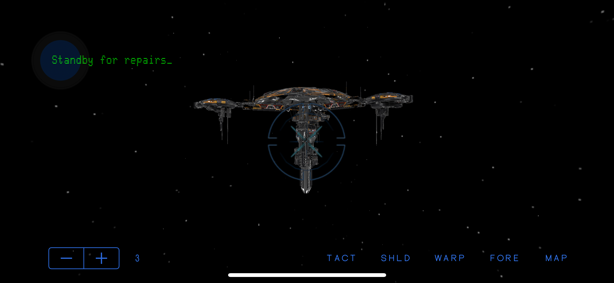

An unofficial sequel to Doug Neubauer's classic Star Raiders, played from the vantage point of the Zylons.

This is a personal project which serves as a tribute to the greatest game ever written, Star Raiders. While the first-person space combat simlulator space has seen many impressive efforts (Elite, Wing Commander, Freespace, Star Citizen) since Doug Neubauer single-handedly created it in 1979, none have been able to duplicate the perfect balance of strategy and twitch-gaming fun that made the original so much fun to play, as well as beautiful to behold (for its day). It's frankly impossible to overstate just how groundbreaking this game was in 1979.

This project attempts to address that vaccum, using a modern mobile platform to provide a new generation of gamers a glimpse into what made Star Raiders such an important part of videogame history. In it, you once again play a pilot defending against a merciless onslaught of invading aliens - only this time, it's the Humons who are attacking, and the Zylons you are helping to defend their home world. 

Despite the reversal of perspective, Zylon Raiders aims to evoke the gameplay style of a bygone era, taking advantage of modern computing power and addressable memory to allow the sorts of bells and whistles which would have been impossible on an 8-bit platform with 8K of RAM. Amongst these is your artificially intelligent copilot, Kohai, providing spoken commentary throughout the game, truly 3-D enemy ships and galactic map, and HUD graphics inspired by the greatest scifi films and games of the 80s and 90s.

Essentially, the goal is to create a game that would have blown the mind of any 14 year old growing up in the 1970s/80s, and can entertain the more jaded eye of gamers who came of age in the twenty-first century.

For more information on design influences for Zylon Defenders, see the original design document:

https://docs.google.com/document/d/1DWboo3A6dUsAj6cX4qb_FdGhXjEqxFH2TOk_diGrsWg/edit?usp=sharing 

This is also a project I use to explore interesting iOS frameworks, technologies, or programming techniques. The latest of these is MultiPeer Connectivity, which allows a second iOS device to remotely control the Zylon ship, and/or introduce gameplay elements to challenge the primary player in much the same way a dungeonmaster might throw challenges at his adventurers in a game of D&D.

Others include SceneKit (used for the lion's share of game mechanics) and Spritekit (used for "HUD" display and other interactive 2D graphic elements). Persistent store for the gamestate will be managed by Coredata.

Special thanks to Lorenz Wiest for reverse-engineering and commenting the original Star Raiders source code, without whose efforts I would have been unlikely to duplicate the "steer your torpedoes into the enemy ship" behavior that made the original so much fun, as well as the swarming behavior of Zylon (in my case, Humon) ships.
  

